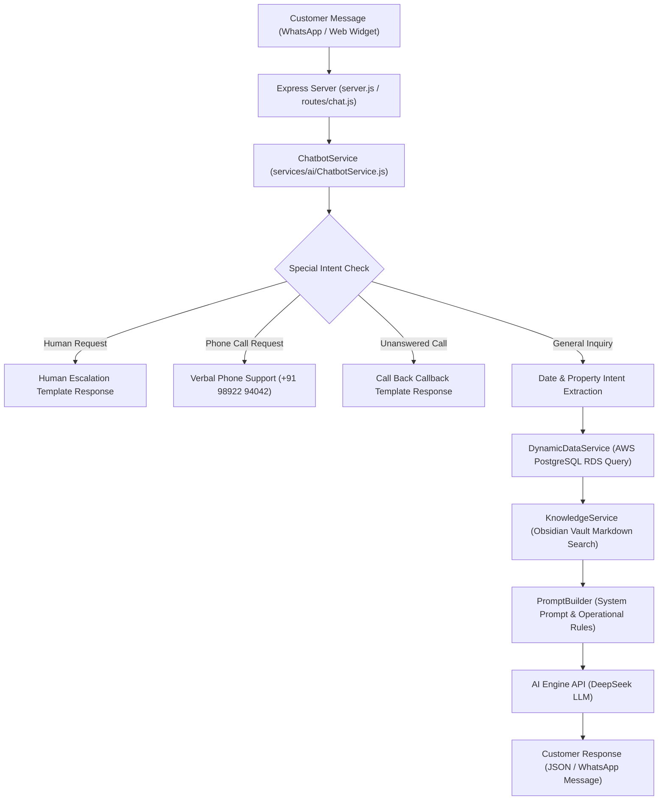

# Galaxia Chatbot V2 - Comprehensive System Guide & File Reference

## 1. System Overview

**Galaxia Chatbot V2** is an enterprise-grade AI chatbot system built for **Galaxia Resorts & Digital Diaries Wadala**. It delivers automated, real-time customer support, booking inquiries, slot availability checking, pricing details, and policy enforcement across WhatsApp and Web interfaces.

The engine powers **3 distinct AI Assistants** from a single unified codebase:
1. **Digital Diaries Assistant (`digital_diaries`)**: Manages Wadala private cinema screening room inquiries (Sandy Screen, Park N Watch, Cine Love, Baywatch), hourly slots, strict 18+ policy, zero-smoking/drinking rules, and package add-ons.
2. **Amstel Nest Assistant (`amstel_nest`)**: Dedicated assistant for the 14-unit Amstel Nest Standard Cottage property in Karjat.
3. **Staycation Assistant (`staycation`)**: Handles multi-property luxury villas (Ambrose Villas: Santorini, Take-1, Alta, Cypress, Bamboosa; Heavenly Villa, La Paraiso, Mount View, Hill View, Family Cottage).

---

## 2. System Architecture & Request Lifecycle



### Key Technical Characteristics:
- **Zero Hallucination Availability**: Real-time SQL queries against AWS PostgreSQL RDS ensure check-in dates and DD hourly slots match live database calendars.
- **RAG Knowledge Retrieval**: RAG engine searches markdown files inside `GALAXIA1/` Vault to pull exact policies, pricing tables, food menus, and transport directions.
- **Strict Phrasing Rules**: Forbidden from using words like "unit" or "units" with customers; state "1 villa" or "1 screen" ONLY if explicitly asked.

---

## 3. Directory & File Mapping (`mainchatbotgalaxia/`)

Below is the complete mapping of every file and directory in `mainchatbotgalaxia/`:

```text
mainchatbotgalaxia/
├── .env                              # Environment variables (AWS PostgreSQL RDS URL, DeepSeek API Key, Meta WhatsApp Tokens)
├── .gitignore                        # Git ignore patterns
├── .vercel/                          # Vercel production deployment project binding
├── server.js                         # Main Express application server & static file host
├── vercel.json                       # Vercel serverless routing configuration
├── package.json                      # Node.js dependencies & scripts
├── package-lock.json                 # Locked dependency tree
├── ecosystem.config.js               # PM2 process manager configuration (for EC2 / Linux hosting)
├── migrate.js                        # Database migration runner
├── migrate-chat.js                   # Conversation table migration utility
├── migrate-to-obsidian.js            # Automated markdown vault converter
├── resubscribe.js                    # Webhook subscription auto-renewer
├── test-chatbot-v2.js                # Command-line chatbot testing script
├── update_tokens.js                  # Meta WhatsApp token updater
│
├── services/                         # Core AI Engine & Services
│   ├── ai/
│   │   ├── ChatbotService.js         # Main AI orchestrator, intent router & session manager
│   │   ├── DynamicDataService.js     # Live PostgreSQL availability & rate lookup service
│   │   ├── PromptBuilder.js          # System prompt builder & 24 operational business rules
│   │   ├── KnowledgeService.js       # RAG Markdown Vault reader & retriever
│   │   ├── EmbeddingService.js       # Vector embedding fallback generator
│   │   └── VectorStore.js            # Qdrant / in-memory vector similarity search
│   ├── db.js                         # PostgreSQL connection pool with AWS RDS fallback
│   ├── conversationService.js        # Chat history database persistence service
│   ├── menuEngine.js                 # Interactive WhatsApp button menu generator
│   └── whatsappService.js            # Meta WhatsApp Cloud API messaging client
│
├── GALAXIA1/                         # Knowledge Base (Obsidian Vault)
│   ├── Digital Diaries/              # Digital Diaries screening room markdown notes
│   │   ├── Screens Overview.md       # Capacities (Sandy: 3, Park N Watch: 3, Baywatch: 3, Cine Love: 8) & 15x8 sq ft room sizes
│   │   ├── Booking.md                # Slot booking rules, UI '+' icon instructions, 10 PM closing cap
│   │   ├── Policies.md               # Strict 18+ age rule, Zero Smoking, Zero Alcohol, No CCTV
│   │   ├── Pricing.md                # Movie Time & Celebration Package rate tables
│   │   ├── Decorations.md            # Add-on prices (Balloons ₹400, LED Banner ₹400, Cake ₹400)
│   │   ├── Contact & Support.md      # Phone call support number (+91 98922 94042) & callback rules
│   │   ├── Bot Operational Rules.md # Strict bot language & operational directives
│   │   └── Digital Diaries Index.md  # Knowledge base sitemap
│   └── Staycation/                   # Staycation villas markdown notes
│       ├── General/                  # General staycation policies & booking rules
│       └── Properties/               # Individual villa notes (Ambrose, Santorini, Amstel Nest, etc.)
│
├── routes/                           # Express HTTP Route Handlers
│   ├── chat.js                       # API endpoint POST /chat for web widget & API testing
│   ├── webhook.js                    # Webhook endpoint POST /webhook for Meta WhatsApp & Instagram
│   └── widget.js                     # Test interface routes
│
├── widget/                           # Web Chat Widget Interface
│   ├── test.html                     # Multi-bot testing interface (served at root '/')
│   ├── galaxia-chat.js               # Frontend chat widget JavaScript engine
│   └── galaxia-chat.css              # Glassmorphic UI styling
│
├── data/                             # System Configuration Data
│   └── ai_config.json                # LLM model selection (deepseek-v4-flash) & parameters
│
├── scratch/                          # Automated Verification & Test Suite Scripts
│   ├── test_50_suites.js             # Automated 50-query test suite
│   ├── test_3h_cinelove.js           # 10 PM closing time boundary test script
│   ├── test_dd_3_new_rules.js        # Balloons, drinking prohibition & unanswered call test
│   └── test_no_unit_language.js      # Strict unit phrasing prohibition test
│
├── legacy_scripts/                   # Preserved Migration & Administrative Scripts
│   ├── subscribe_webhook.js          # WhatsApp Meta webhook registration tool
│   ├── subscribe_waba.js             # WABA account subscription tool
│   ├── find_waba.js                  # WABA ID finder utility
│   └── check_sessions.js             # Session inspector tool
│
└── AI_Bots_Code/                     # Reference Single-File Bot Snapshots
