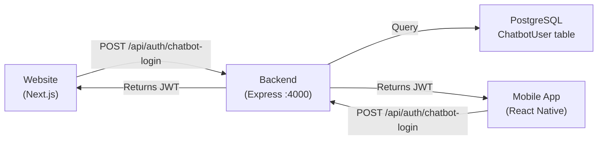

# Server-Backed Chatbot Auth — Implementation Plan

## Goal
Replace hardcoded mock auth in the chatbot dashboard (both website & app) with real backend API authentication. One password change works everywhere.

---

## Architecture Overview



> [!IMPORTANT]
> Chatbot users are **separate** from admin users. The admin app uses `AdminAccount` (krish, ranjit, devi). The chatbot dashboard uses its own users (owner, stay123, ddadmin, igadmin). Keep them in a **separate table**.

---

## Step 1: Database — New `ChatbotUser` Model

Add to [schema.prisma](file:///C:/Users/K/Desktop/FINAL%20PROJ/GLXAPP/GLX2/backend/prisma/schema.prisma):

```prisma
model ChatbotUser {
  id              Int      @id @default(autoincrement())
  username        String   @unique
  passwordHash    String
  displayName     String
  role            String   @default("chatbot_admin")  // owner | chatbot_admin | staycation_call_manager | test_viewer
  assignedNumbers String[] @default([])               // ["digital_diaries", "dd_instagram", "wa_staycation", ...]
  isActive        Boolean  @default(true)
  createdAt       DateTime @default(now())
  updatedAt       DateTime @updatedAt
}
```

Then run:
```bash
npx prisma migrate dev --name add-chatbot-users
```

### Seed the default users

Create a seed script or add to existing seed. Use `bcrypt` to hash passwords:

```typescript
import bcrypt from 'bcrypt';

const chatbotUsers = [
  { username: 'owner',       password: 'owner123', role: 'owner',                    displayName: 'Owner',                   assignedNumbers: ['digital_diaries','dd_instagram','wa_staycation','wa_amstelnest','website','ig_ambrose','ig_amstelnest','ig_laparaiso','ig_mountview','ig_heavenlyvilla','ig_hillview'] },
  { username: 'test',        password: 'test@123', role: 'test_viewer',              displayName: 'Test Account',            assignedNumbers: ['digital_diaries','dd_instagram','wa_staycation','wa_amstelnest','website','ig_ambrose','ig_amstelnest','ig_laparaiso','ig_mountview','ig_heavenlyvilla','ig_hillview'] },
  { username: 'stay123',     password: 'stay123',  role: 'staycation_call_manager',  displayName: 'Staycation Call Manager', assignedNumbers: ['wa_staycation','wa_amstelnest','website','ig_ambrose','ig_amstelnest','ig_laparaiso','ig_mountview','ig_heavenlyvilla','ig_hillview'] },
  { username: 'staycation1', password: 'stay123',  role: 'chatbot_admin',            displayName: 'Staycation 1 Admin',      assignedNumbers: ['wa_staycation','wa_amstelnest','website','ig_ambrose','ig_amstelnest','ig_laparaiso','ig_mountview','ig_heavenlyvilla','ig_hillview'] },
  { username: 'staycation2', password: 'stay123',  role: 'chatbot_admin',            displayName: 'Staycation 2 Admin',      assignedNumbers: ['wa_staycation'] },
  { username: 'ddadmin',     password: 'dd123',    role: 'chatbot_admin',            displayName: 'Digital Diaries Admin',   assignedNumbers: ['digital_diaries','dd_instagram','website'] },
  { username: 'igadmin',     password: 'ig123',    role: 'chatbot_admin',            displayName: 'IG Admin',                assignedNumbers: ['ig_ambrose','ig_amstelnest','ig_laparaiso','ig_mountview','ig_heavenlyvilla','ig_hillview'] },
];

for (const u of chatbotUsers) {
  const passwordHash = await bcrypt.hash(u.password, 10);
  await prisma.chatbotUser.upsert({
    where: { username: u.username },
    update: { passwordHash, role: u.role, displayName: u.displayName, assignedNumbers: u.assignedNumbers },
    create: { username: u.username, passwordHash, role: u.role, displayName: u.displayName, assignedNumbers: u.assignedNumbers },
  });
}
```

---

## Step 2: Backend — New Auth Endpoints

Add a new route file `src/routes/chatbotAuth.ts` (or add to existing `auth.ts`):

### `POST /api/auth/chatbot-login`

```typescript
import bcrypt from 'bcrypt';
import jwt from 'jsonwebtoken';

router.post('/chatbot-login', async (req, res) => {
  const { username, password } = req.body;
  if (!username || !password) return res.status(400).json({ error: 'Username and password required' });

  const user = await prisma.chatbotUser.findUnique({ where: { username: username.toLowerCase() } });
  if (!user || !user.isActive) return res.status(401).json({ error: 'Invalid credentials' });

  const valid = await bcrypt.compare(password, user.passwordHash);
  if (!valid) return res.status(401).json({ error: 'Invalid credentials' });

  const token = jwt.sign(
    { id: user.id, username: user.username, role: user.role, type: 'chatbot' },
    process.env.JWT_SECRET!,
    { expiresIn: '30d' }
  );

  res.json({
    token,
    user: {
      username: user.username,
      role: user.role,
      displayName: user.displayName,
      assignedNumbers: user.assignedNumbers,
    },
  });
});
```

### `GET /api/auth/chatbot-me`

```typescript
// Uses same authMiddleware but checks type === 'chatbot'
router.get('/chatbot-me', authMiddleware, async (req, res) => {
  const admin = req.admin; // from JWT
  const user = await prisma.chatbotUser.findUnique({ where: { id: admin.id } });
  if (!user) return res.status(401).json({ error: 'User not found' });

  res.json({
    username: user.username,
    role: user.role,
    displayName: user.displayName,
    assignedNumbers: user.assignedNumbers,
  });
});
```

### `PATCH /api/auth/chatbot-users/:username` (Settings — owner only)

```typescript
router.patch('/chatbot-users/:username', authMiddleware, requireRole('owner'), async (req, res) => {
  const { username } = req.params;
  const { password, newUsername, displayName, assignedNumbers } = req.body;

  const updateData: any = {};
  if (password) updateData.passwordHash = await bcrypt.hash(password, 10);
  if (newUsername) updateData.username = newUsername.toLowerCase();
  if (displayName) updateData.displayName = displayName;
  if (assignedNumbers) updateData.assignedNumbers = assignedNumbers;

  const user = await prisma.chatbotUser.update({
    where: { username: username.toLowerCase() },
    data: updateData,
  });

  res.json({ success: true, user: { username: user.username, displayName: user.displayName, assignedNumbers: user.assignedNumbers } });
});
```

### `GET /api/auth/chatbot-users` (Settings list — owner only)

```typescript
router.get('/chatbot-users', authMiddleware, requireRole('owner'), async (req, res) => {
  const users = await prisma.chatbotUser.findMany({
    select: { username: true, displayName: true, role: true, assignedNumbers: true, isActive: true },
    orderBy: { id: 'asc' },
  });
  res.json(users);
});
```

### Mount the routes

In `src/index.ts`, the auth routes are already mounted at `/api/auth`. Just add the new endpoints to the existing `auth.ts` file, or import & mount a new file:

```typescript
import chatbotAuthRoutes from './routes/chatbotAuth';
app.use('/api/auth', chatbotAuthRoutes);
```

---

## Step 3: Website — Update Chatbot Login Page

File: [app/chatbot/page.tsx](file:///C:/Users/K/Desktop/FINAL%20PROJ/GLXAPP/GLX2/FRONTEND/galaxia/app/chatbot/page.tsx)

### Replace mock login with real API call

**Before** (current — hardcoded):
```typescript
const user = DEFAULT_USERS[username.toLowerCase()];
if (!user || user.password !== password) { setError('Invalid'); return; }
localStorage.setItem("chatbot_session", JSON.stringify({ role: user.role, ... }));
```

**After** (API-backed):
```typescript
const handleLogin = async () => {
  setError(''); setLoading(true);
  try {
    const res = await fetch('/api/auth/chatbot-login', {
      method: 'POST',
      headers: { 'Content-Type': 'application/json' },
      body: JSON.stringify({ username, password }),
    });
    if (!res.ok) {
      const data = await res.json();
      throw new Error(data.error || 'Login failed');
    }
    const data = await res.json();
    // Store token + session
    localStorage.setItem('chatbot_token', data.token);
    localStorage.setItem('chatbot_session', JSON.stringify({
      username: data.user.username,
      role: data.user.role,
      displayName: data.user.displayName,
      assignedNumbers: data.user.assignedNumbers,
    }));
    router.push('/chatbot/dashboard');
  } catch (err: any) {
    setError(err.message || 'Login failed');
  } finally {
    setLoading(false);
  }
};
```

### Delete
- The `DEFAULT_USERS` constant
- The `DEFAULT_PASSWORDS` constant  
- The `localStorage.getItem("chatbot_passwords")` overrides logic
- Everything related to mock auth

---

## Step 4: Website — Update Settings Modal

File: [app/chatbot/dashboard/page.tsx](file:///C:/Users/K/Desktop/FINAL%20PROJ/GLXAPP/GLX2/FRONTEND/galaxia/app/chatbot/dashboard/page.tsx) (lines 183-254)

### Load users from API instead of hardcoded ACCOUNTS

```typescript
function SettingsModal({ onClose }: { onClose: () => void }) {
  const [users, setUsers] = useState<{ username: string; password: string; displayName: string; role: string; assignedNumbers: string[] }[]>([]);
  const [saved, setSaved] = useState(false);

  useEffect(() => {
    const token = localStorage.getItem('chatbot_token');
    fetch('/api/auth/chatbot-users', {
      headers: { Authorization: `Bearer ${token}` },
    })
      .then(r => r.json())
      .then(data => setUsers(data.map((u: any) => ({ ...u, password: '' })))) // password blank = unchanged
      .catch(() => {});
  }, []);

  const handleSave = async () => {
    const token = localStorage.getItem('chatbot_token');
    for (const u of users) {
      const body: any = {};
      if (u.password) body.password = u.password; // only send if changed
      await fetch(`/api/auth/chatbot-users/${u.username}`, {
        method: 'PATCH',
        headers: { 'Content-Type': 'application/json', Authorization: `Bearer ${token}` },
        body: JSON.stringify(body),
      });
    }
    setSaved(true);
    setTimeout(() => setSaved(false), 2000);
  };
  // ... render table with username (readonly), password (editable), access label
}
```

### Delete
- The `ACCOUNTS` constant
- The `DEFAULT_PASSWORDS` constant
- All `localStorage.getItem("chatbot_passwords")` logic

---

## Step 5: Website — Add Token to API Calls

The dashboard makes API calls to the bot server via `/bot/api/...`. These don't need auth (the bot server is internal). But the new chatbot-user endpoints need the JWT token.

Add a helper at the top of the dashboard:
```typescript
function authHeaders() {
  const token = localStorage.getItem('chatbot_token');
  return token ? { Authorization: `Bearer ${token}` } : {};
}
```

Use it for any `/api/auth/chatbot-*` calls.

---

## Step 6: Validate Session on Dashboard Load

In the dashboard's auth check `useEffect` (line 280-287), also validate the token is still valid:

```typescript
useEffect(() => {
  setMounted(true);
  const token = localStorage.getItem('chatbot_token');
  const s = JSON.parse(localStorage.getItem('chatbot_session') || 'null');
  if (!s || !token) { router.replace('/chatbot'); return; }
  
  // Optionally validate token with /api/auth/chatbot-me
  fetch('/api/auth/chatbot-me', { headers: { Authorization: `Bearer ${token}` } })
    .then(r => {
      if (!r.ok) throw new Error();
      return r.json();
    })
    .then(fresh => {
      // Update session with latest data from server (in case assignedNumbers changed)
      const updated = { ...s, ...fresh };
      localStorage.setItem('chatbot_session', JSON.stringify(updated));
      setSession(updated);
    })
    .catch(() => {
      localStorage.removeItem('chatbot_token');
      localStorage.removeItem('chatbot_session');
      router.replace('/chatbot');
    });
}, [router]);
```

---

## File Change Summary

| File | Action |
|------|--------|
| `backend/prisma/schema.prisma` | Add `ChatbotUser` model |
| `backend/src/routes/chatbotAuth.ts` | **New file** — login, me, list users, update user |
| `backend/src/index.ts` | Mount chatbotAuth routes |
| `backend/prisma/seed.ts` | Seed 7 default chatbot users |
| `FRONTEND/.../chatbot/page.tsx` | Replace mock login → `POST /api/auth/chatbot-login` |
| `FRONTEND/.../chatbot/dashboard/page.tsx` | Settings modal → fetch/patch real API; session validation |

---

## After You Implement

Once the website is working with real API auth, tell me and I'll update both mobile apps to:
1. **Chatbot app**: Replace `MOCK_USERS` in `ChatbotAuthContext.tsx` with `POST /api/auth/chatbot-login` API call
2. **Chatbot app**: Settings modal → `GET/PATCH /api/auth/chatbot-users`
3. **Admin app**: No changes needed (already uses real backend auth)

> [!TIP]
> Test the migration by:
> 1. Run `npx prisma migrate dev`
> 2. Run the seed script
> 3. Try logging in on the website with `owner / owner123`
> 4. Change `ddadmin`'s password via Settings
> 5. Verify the new password works on both website refresh AND mobile app
