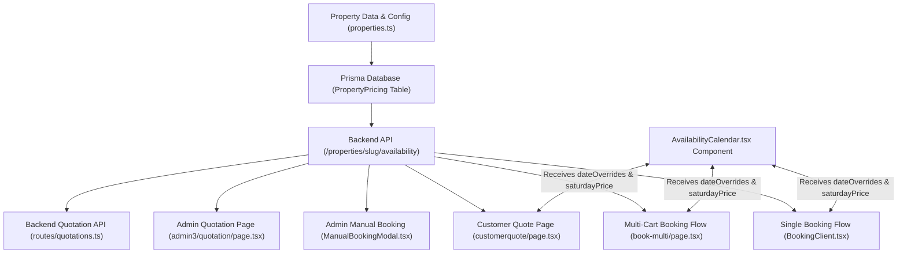

# Prime Date Price Override Methodology & Architecture Guide

## 1. Executive Summary
This document provides a complete technical walkthrough of how date-specific prime price overrides (such as August 14 and August 15) are implemented, evaluated, rendered, and persisted across the entire Galaxia Resorts web platform (Frontend User Single & Multi-Cart Booking, Availability Calendar, Admin Manual Booking, Customer & Admin Quotation Systems, and Backend Database).

---

## 2. Core Architecture & End-to-End Flow



---

## 3. Detailed Implementation Steps

### Layer 1: Static Configuration & Type Safety (`properties.ts`)
Each property and subproperty object includes a `dateOverrides` map under `pricing`:
```ts
dateOverrides: {
  "2026-08-14": 7500,
  "2026-08-15": 9500
}
```
**Applied To:**
- Amstel Nest (`standard-cottage`, `family-cottage`)
- Ambrose Villas (`take-1`, `alta`, `santorini`, `bamboosa`, `cypress`)
- Standalone Properties (`hill-view`, `mount-view`, `heavenly-villa`, `la-paraiso`)

---

### Layer 2: Database Persistence (`PropertyPricing` Table)
1. In PostgreSQL via Prisma, prime date overrides are stored as rows in `PropertyPricing` with `dayType = 'prime'`, `overrideDate`, and `basePrice`.
2. Created and executed `backend/scripts/update_all_prime_prices.ts` to ensure database records are present for August 14 and August 15 for all properties/subproperties.

---

### Layer 3: User Single Booking Flow (`BookingClient.tsx` & `AvailabilityCalendar.tsx`)
1. **Per-Night Calculation:**
   `computedRoomPrice` iterates through each night in the selected date range:
   - If `dateOverrides[dateStr]` exists, use that price.
   - Otherwise, fall back to Saturday, Weekend, or Weekday pricing.
2. **Calendar Rendering:**
   `AvailabilityCalendar.tsx` receives `dateOverrides` as a prop and formats date labels accordingly.

---

### Layer 4: User Multi-Cart Flow (`book-multi/page.tsx`)
1. **Type Definitions:**
   `CartItem` and `pricingMap` include `dateOverrides?: Record<string, number>`.
2. **Cart Item Price Engine (`getItemPrice`):**
   Evaluates `item.dateOverrides[dateStr]` first for any item in cart; if missing, falls back to property-specific 14/15 August override rules.
3. **Cart Storage:**
   Cart items stored in `localStorage` (`ambrose_cart`) include `saturdayPrice` and `dateOverrides` so modal views retain exact pricing.

---

### Layer 5: Admin Manual Booking (`ManualBookingModal.tsx`)
1. **Priority Evaluation in `getUnitRates()`:**
   Evaluates 14/15 August prime date overrides **BEFORE** checking `livePricing` objects or general day-of-week rates.
2. **Date Propagation:**
   All pricing calculations, split-booking loops, and payload assemblies pass the `currentDate` / `start` Date object to `getUnitRates()`.

---

### Layer 6: Quotation Systems (`admin3/quotation/page.tsx`, `customerquote/page.tsx`, & `routes/quotations.ts`)
1. **Slug Resolution:**
   `resolvePropertySlug()` maps complex property titles (e.g. `"Amstel Nest (Standard Cottage)"`) to their backend slug.
2. **Unit Calculation (`calcUnit`):**
   Checks `is14Aug` and `is15Aug` for all properties to calculate exact room rates and guest charges.
3. **Quotation Calendar:**
   `AvailabilityCalendar` on `customerquote/page.tsx` receives property fallback `dateOverrides` so dates display the prime prices on public quotation links.

---

## 4. Summary of Rates (14 & 15 August 2026)

| Property / Villa Name | Standard Rates (Fri / Sat) | 14 Aug Price (Fri) (+₹1,000) | 15 Aug Price (Sat) (+₹1,000) |
| :--- | :--- | :--- | :--- |
| **Take-1** (Ambrose) | ₹6,500 / ₹8,500 | **₹7,500** | **₹9,500** |
| **Alta** (Ambrose) | ₹6,500 / ₹8,500 | **₹7,500** | **₹9,500** |
| **Santorini** (Ambrose) | ₹6,500 / ₹8,500 | **₹7,500** | **₹9,500** |
| **Cypress** (Ambrose) | ₹6,500 / ₹6,500 | **₹7,500** | **₹7,500** |
| **Bamboosa** (Ambrose) | ₹11,500 / ₹13,000 | **₹12,500** | **₹14,000** |
| **Heavenly Villa** | ₹4,950 / ₹4,950 | **₹5,950** | **₹5,950** |
| **Mount View** | ₹4,950 / ₹4,950 | **₹5,950** | **₹5,950** |
| **Hill View** | ₹3,950 / ₹3,950 | **₹4,950** | **₹4,950** |
| **La Paraiso** | ₹7,500 / ₹8,500 | **₹8,500** | **₹9,500** |
| **Amstel Nest Standard** | ₹5,950 / ₹6,950 | **₹7,950** | **₹8,500** |
| **Amstel Nest Family** | ₹10,000 / ₹12,000 | **₹11,000** | **₹13,500** |

---

## 5. Verification Checklist & Best Practices
- **No Duplicate Codeblocks / Algorithms:** Enhanced existing functions rather than creating duplicate code.
- **Type Safety:** Verified `npx tsc --noEmit` on both frontend and backend (**0 errors**).
- **Auto-Deployment:** Committed and pushed to `main` branch (`2267f81`).
